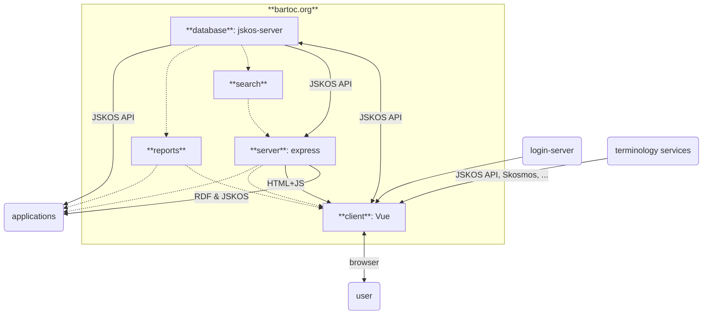

# BARTOC.org


[](https://github.com/gbv/bartoc.org/blob/master/LICENSE)
[](https://github.com/gbv/bartoc.org/blob/master/docker/README.md)
[](https://github.com/gbv/bartoc.org/actions/workflows/test.yml)

> Basic Register of Thesauri, Ontologies & Classifications (BARTOC)

This repository contains the [web interface of BARTOC.org](https://bartoc.org), run by [VZG](https://www.gbv.de/).

The application is currently being reconstructed funded by DFG.

## Table of Contents

- [Install](#install)
- [Data flow](#data-flow)
- ...

## Install

### Requirements

Requires at least Node.js 18 and an instance of [jskos-server](https://github.com/gbv/jskos-server) to connect to. Additional dependencies are listed in `package.json`.

### Install from sources

~~~sh
git clone https://github.com/gbv/bartoc.org.git
cd bartoc.org
npm ci
~~~

### Docker

You can also set up BARTOC via Docker. Please refer to our [Docker docs](./docker/README.md).

### Setup
A setup script is provided in `./bin/setup.sh`. It must be called with the path to your jskos-server installation, e.g.:

```bash
./bin/setup.sh ../jskos-server
```

## Configuration

Basic configuration is located in `config/config.default.json`. Selected fields can be overridden in a local `config/config.json`. The latter should at least include a link to a JSKOS server instance, e.g.:

~~~json
{
  "backend": {
    "provider": "ConceptApi",
    "api": "http://localhost:3000/"
  }
}
~~~

To be able to log in, add, and edit vocabularies, you need to setup and configure an instance of [Login Server](https://github.com/gbv/login-server) as well (example for local installation):
```json
{
  "login": {
    "api": "localhost:3004/",
    "ssl": false
  }
}
```

### jskos-server Configuration
To be able to use the full functionality of BARTOC, your jskos-server installation must allow concept schemes to be written via the API, e.g.:

```json
{
  "schemes": {
    "read": {
      "auth": false
    },
    "create": {
      "auth": true
    },
    "update": {
      "auth": true,
      "crossUser": true
    }
  }
}
```

Via an array `identities` under `schemes`, you can limit which identity URIs can write vocabulary data.

## Data flow

Dotted elements are not implemented yet.



## Development

~~~sh
npm run dev
~~~

The application is made available at <http://localhost:3883/>.

### Publish
**For maintainers only**

Never work on the main branch directly. Always make changes on `dev` and then run the release script:

```bash
npm run release:patch # or minor or major
```

### Deployment

The application is deployed at <https://bartoc.org/>.

Update an existing installation:

~~~sh
git pull
npm install
pm2 restart bartoc.org
~~~

Note that `NODE_ENV` has to be set to `production`, otherwise Vue files will be requested from the dev server. This is given when using `npm run start`.

## Database dumps and statistics

To regularly update dumps, add a cronjob with command `npm run dump update`. Dumps will be placed in directory `data/dumps` and statistics are placed in `data/reports`. To compare two dump files run `npm run dump diff`.
